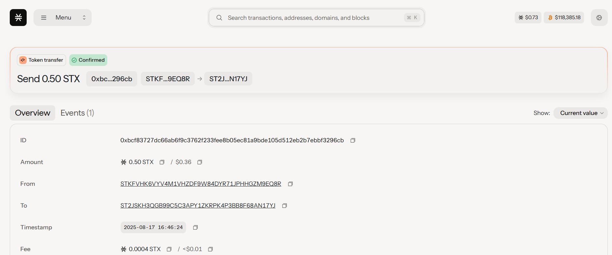

# Token-Based Voting System

## Project Description

This project implements a **decentralized voting system** where each participant's **voting power is determined by their token balance**. Instead of the traditional "one person, one vote" system, token holders have influence proportional to the number of tokens they own.

The system allows users to:
- Create governance proposals with titles and descriptions
- Vote on proposals with voting power equal to their token balance
- Transfer tokens (which affects their voting power)
- Query proposal details and voting results

## Project Vision

Our vision is to create a **fair and transparent governance system** that gives stakeholders voting power proportional to their investment and commitment to the platform. This token-weighted voting mechanism ensures that those with the most at stake have the greatest say in important decisions, while still maintaining decentralization and preventing any single entity from having absolute control.

Key principles:
- **Proportional Representation**: Voting power scales with token ownership
- **Transparency**: All votes and proposals are recorded on-chain
- **Accessibility**: Any token holder can participate in governance
- **Flexibility**: Proposal creators can set custom voting durations

## Core Functions

### 1. `create-proposal`
- **Purpose**: Allows token holders to create new governance proposals
- **Parameters**: 
  - `title`: Brief proposal title (max 100 characters)
  - `description`: Detailed proposal description (max 500 characters)
  - `voting-duration`: Number of blocks the voting period will last
- **Requirements**: Caller must own at least 1 token
- **Returns**: Unique proposal ID

### 2. `vote`
- **Purpose**: Enables token holders to vote on active proposals
- **Parameters**:
  - `proposal-id`: ID of the proposal to vote on
  - `support`: Boolean (true for yes, false for no)
- **Voting Power**: Equal to the voter's current token balance
- **Requirements**: 
  - Proposal must be active and within voting period
  - Voter must own tokens
  - Voter cannot vote twice on the same proposal

## Future Scope

### Phase 1 Enhancements
- **Proposal Execution**: Automatic execution of passed proposals
- **Minimum Quorum**: Require minimum participation for valid votes
- **Vote Delegation**: Allow token holders to delegate their voting power
- **Proposal Deposits**: Require token deposits to create proposals (returned if proposal reaches quorum)

### Phase 2 Advanced Features
- **Time-locked Voting**: Prevent last-minute token transfers to influence votes
- **Quadratic Voting**: Implement quadratic voting to balance large and small holders
- **Multi-choice Proposals**: Support proposals with multiple options
- **Proposal Categories**: Different types of proposals with different requirements

### Phase 3 Ecosystem Integration
- **Treasury Management**: Direct control over protocol treasury funds
- **Parameter Adjustment**: Vote on protocol parameters and fee structures
- **Upgrade Governance**: Control smart contract upgrades through voting
- **Cross-chain Governance**: Extend voting to multiple blockchain networks

### Technical Improvements
- **Gas Optimization**: Reduce transaction costs for voting
- **Mobile Interface**: User-friendly mobile app for governance participation
- **Analytics Dashboard**: Real-time governance metrics and participation tracking
- **API Integration**: RESTful APIs for third-party integrations

## Contract Address

**Mainnet**: `[Contract will be deployed here]`
**Testnet**: `[Testnet deployment address]`

---

## Getting Started

### Prerequisites
- Stacks wallet with STX for transaction fees
- Governance tokens for voting power

### Basic Usage
1. **Deploy Contract**: Deploy the contract and call `init()` to initialize
2. **Acquire Tokens**: Obtain governance tokens through the initial distribution or transfers
3. **Create Proposals**: Use `create-proposal` to submit new governance proposals
4. **Vote**: Use `vote` function to participate in active proposals
5. **Monitor Results**: Check proposal outcomes using read-only functions

### Example Workflow
```clarity
;; Initialize contract (owner only)
(contract-call? .voting-system init)

;; Create a proposal
(contract-call? .voting-system create-proposal 
    "Increase Block Rewards" 
    "Proposal to increase mining rewards by 10% to incentivize network security" 
    u144) ;; ~1 day voting period

;; Vote on proposal #1 with support
(contract-call? .voting-system vote u1 true)

;; Check voting power
(contract-call? .voting-system get-voting-power 'ST1PQHQKV0RJXZFY1DGX8MNSNYVE3VGZJSRTPGZGM)
```


## Contributing

We welcome contributions to improve the voting system! Please submit pull requests or open issues for:
- Bug fixes and security improvements
- New feature implementations
- Documentation enhancements
- Test coverage expansion

## Contract Details

Deployed contract address: ST2JSKH3QGB99C5C3APY1ZKRPK4P3BB8F68AN17YJ.votingcontractonstack
